# KnownStudy
教育平台项目

## 1.项目介绍
目前市场上大多数的教育平台方向性十分的明确，要么是辅导小朋友们语数英课程的教学网站，要么就是软件开发的学习网站，而我认为对于一个兴趣爱好广泛的人来说他喜欢的事物很多，那么如果他都想学习，那么就需要记住很多不同的网站,我认为十分的麻烦，所以想自己设计一个网站，里面包含了大多数领域的教学视频，来满足那些爱好广泛的人们。
## 2.项目描述
该项目包含了各个行业的教学视频，可以对视频按照行业进行分类查询等条件查询，实现了视频相关的购物车，订单功能，视频评论功能。用户查看视频后将会有浏览记录产生，在下一次观看该视频时会提示用户。该平台也实现了后台管理子系统来对用户，老师，课程，订单等进行基本的增删改查操作。
项目采用了ssm框架开发，前台使用了thymeleaf模板引擎实现前后端分离，前台发送给后台数据使用ajax异步刷新技术实时更新给前台进行显示。

## 3.项目模块
1.用户模块  
2.老师模块  
3.订单模块  
4.课程模块  
5.评论模块  
6.后台管理模块
## 4.项目截图

#### 前台截图展示
1.首页展示
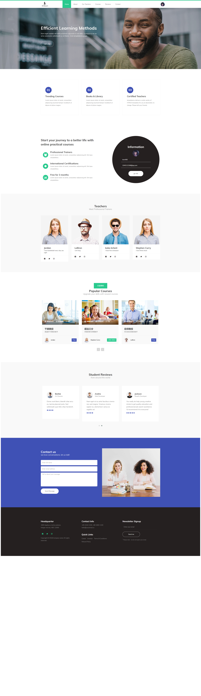
2.个人信息展示
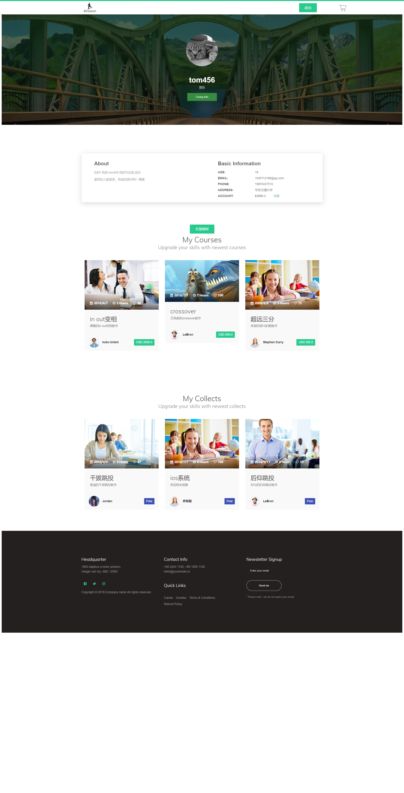
3.老师信息展示
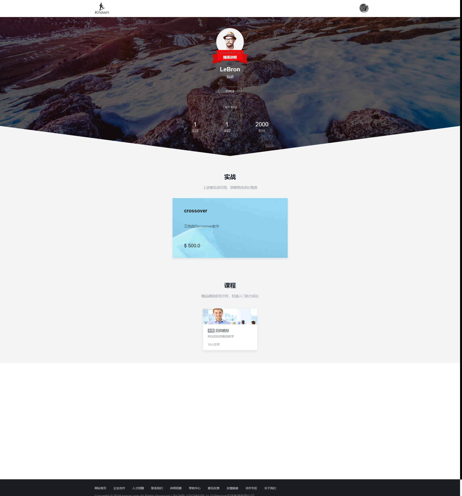
4.课程展示

5.付费课程购买
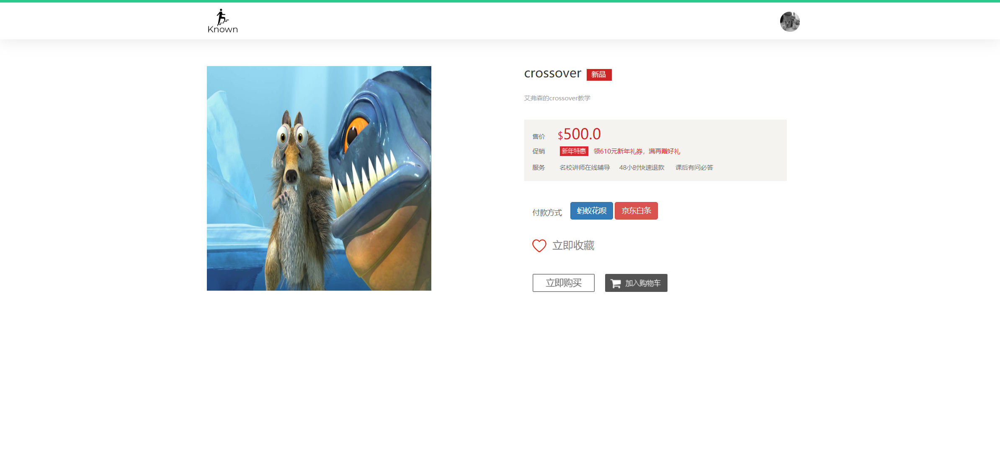
6.购物车
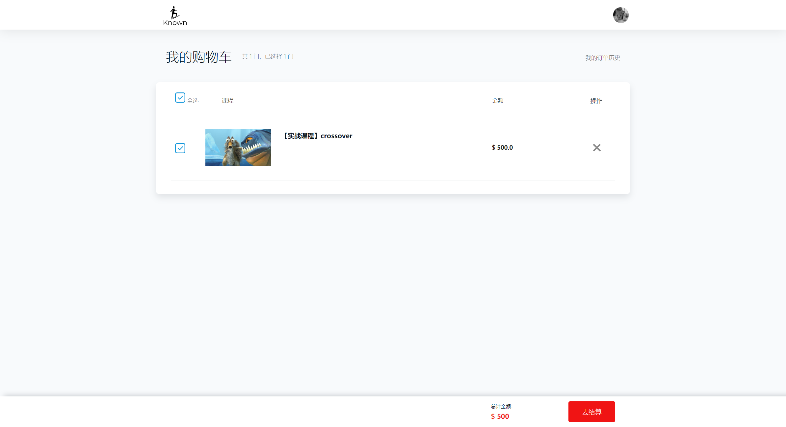
7.订单
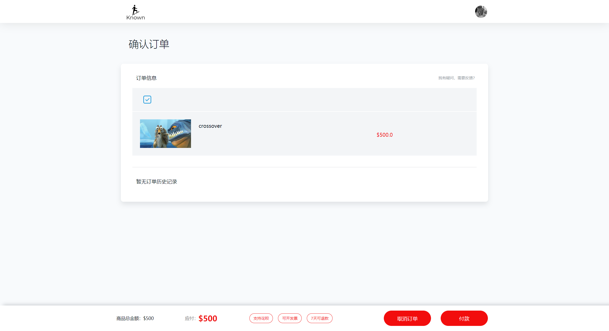
8.充值
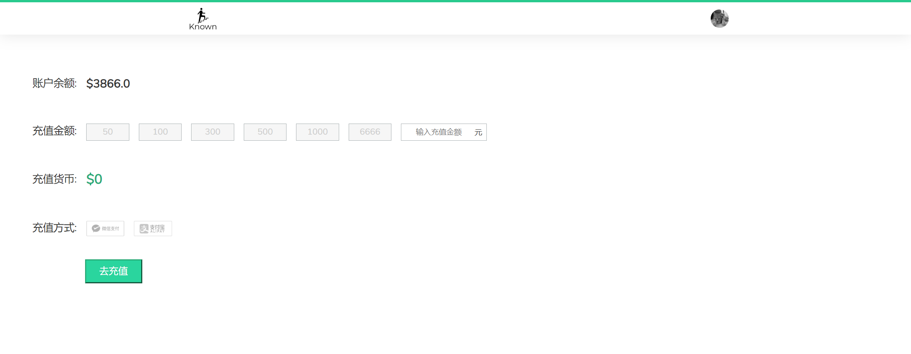
9.课程信息列表
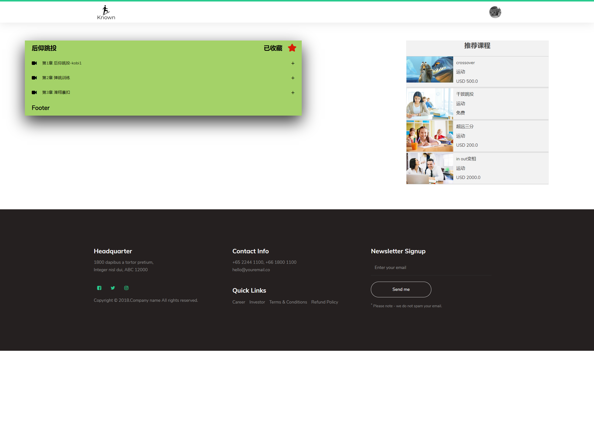
10.视频播放（实现了历史记录）
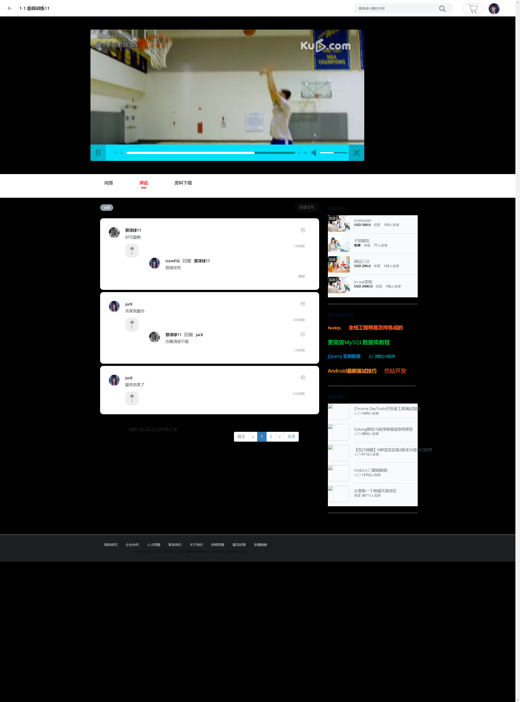
#### 后台截图展示
1.课程管理
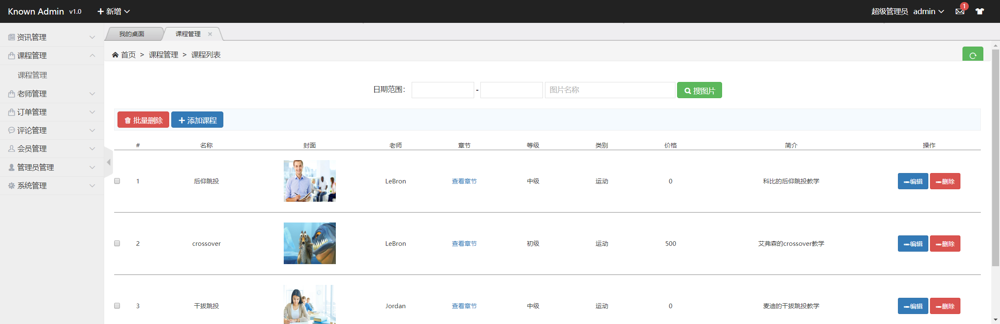
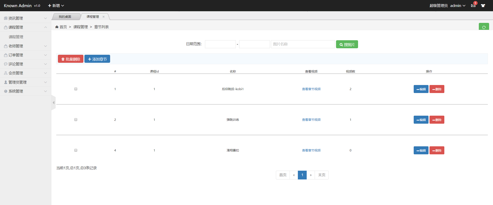
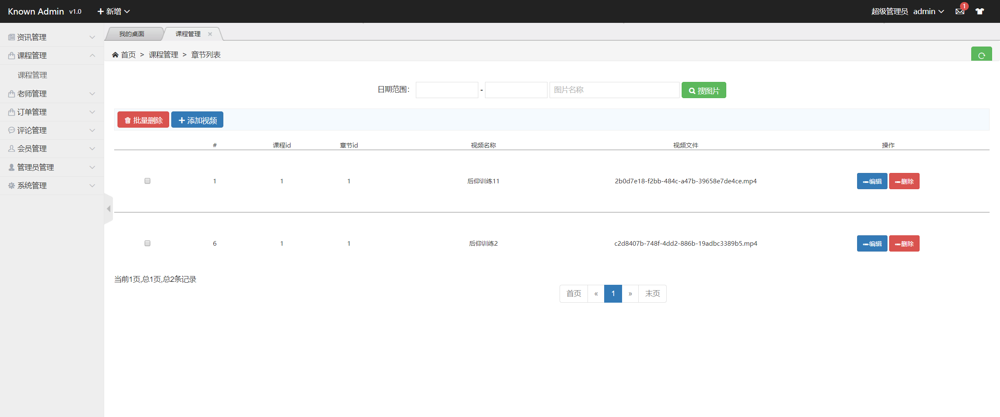
2.用户管理
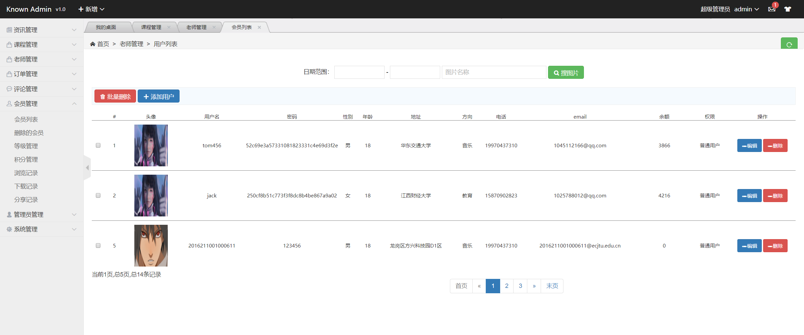
3.老师管理
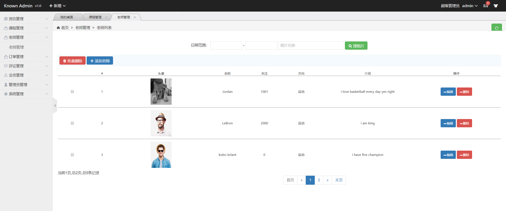
4.订单管理
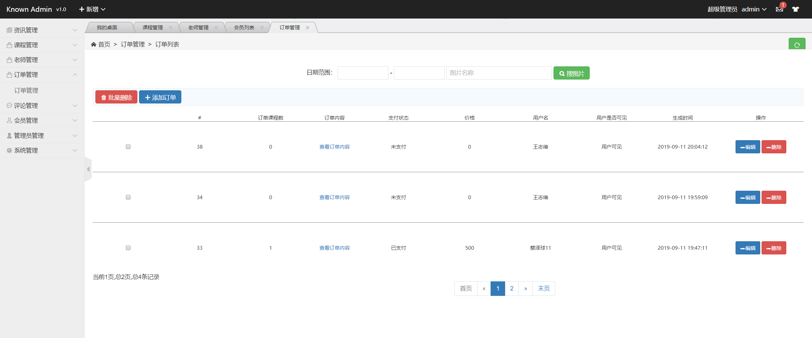
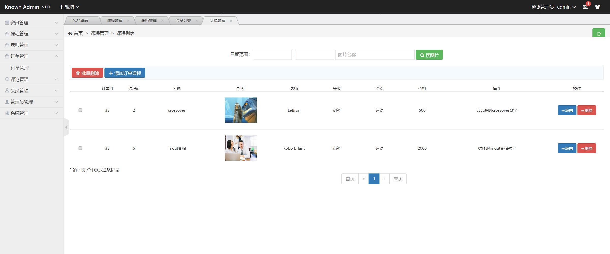
